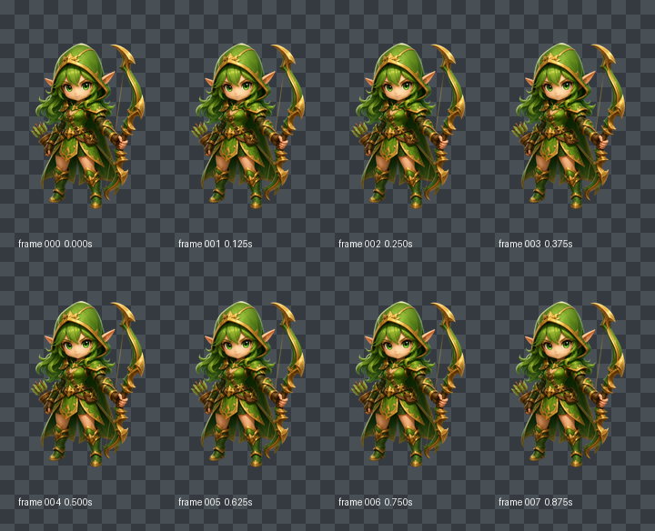
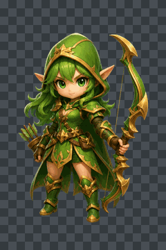
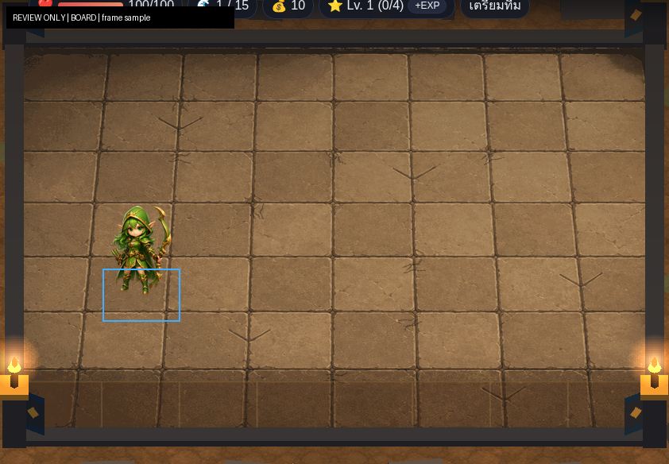
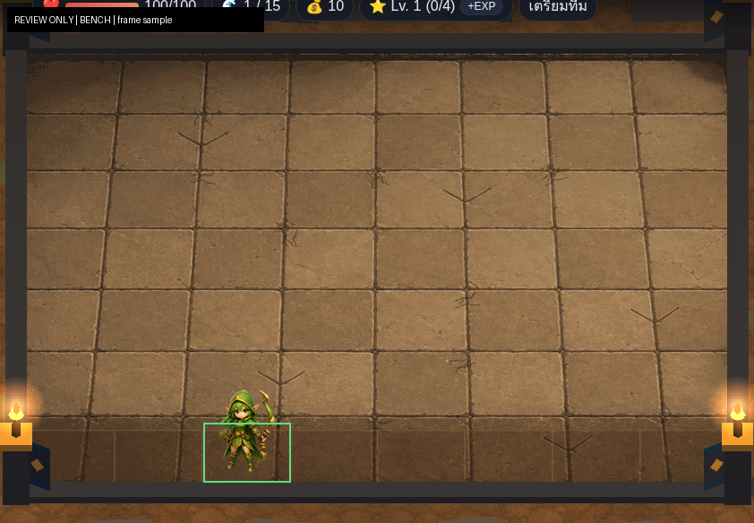

# Archer Idle Production v1

## Decision boundary

This package contains one eight-frame `hero.archer` Idle production candidate derived from the exact user-approved Neutral Master. It does not contain Move, Attack, runtime integration, or an approval decision.

| Status | Value |
|---|---|
| `styleDirectionApproved` | `true` |
| `neutralMasterApproved` | `true` |
| `idlePackageApproved` | `false` |
| `canonicalApproved` | `false` |
| `runtimeEligible` | `false` |
| `runtimeIntegrated` | `false` |

## Verified source and ancestry

GitHub was checked before production.

| Role | PR | Branch | Exact HEAD | Verified state |
|---|---:|---|---|---|
| Exact base and approved source | #61 | `coco/archer-neutral-master-exact-file-approval-v1` | `7e1f0639b577b6f8c1d5f6ba43c8160f1c4115e2` | open, draft, unmerged |
| Motion technical baseline only | #56 | `cc/pilot-idle-motion-runtime-integration-v1` | `bbe63518c42761f49a0aa068c78e0d07d3e88214` | open, draft, unmerged; read-only |

This branch descends directly from exact PR #61. No PR #56 commit, CC runtime ancestry, merge, rebase, or cherry-pick is included.

The only identity source is:

| Field | Exact value |
|---|---|
| Character | `hero.archer` |
| Candidate ID | `hero.archer.production-master.candidate.v1` |
| Path | `docs/assets/review/character-production/archer/master-v1/archer-production-master-candidate-v1.png` |
| SHA-256 | `4911e7e3ba59241ee011be3e62f1b64230dcf9b3c24c6aeb23dc939d83311013` |
| Format | 640×960 RGBA PNG |
| Approval | exact Neutral Master source approved in PR #61 |

The source file remains byte-identical. Frame 000 is also an exact byte copy of it.

## Motion design and production method

The loop is a restrained one-second combat-ready breath. It uses no walk cycle, attack anticipation, root translation, blink, large pose swing, squash/stretch, or generated alternate identity.

Every derived frame independently samples the exact approved master through one deterministic, periodic displacement field. The maximum upper-body movement is 2 pixels upward and 0.65 pixels sideways. Sampling is bilinear in premultiplied RGBA to prevent dark alpha fringes. Rows at and below y=800 are pixel-identical to the approved source, locking both feet and the contact baseline.

This method preserves the approved face, green eyes, hood, hair, ears, chibi proportions, costume, green/gold palette, ornate bow, silhouette, and lighting. It does not repaint or regenerate any feature.

## Technical contract

| Property | Value |
|---|---|
| State | `idle` |
| Frames | 8 |
| FPS | 8 |
| Duration | 1 second |
| Loop | `true` |
| Root motion | `in-place` |
| Event markers | none |
| `runtimeFlipX` | `true`, preserved from the technical baseline |
| Canvas | 640×960 RGBA |
| Anchor | `[0.5, 0.92]` |

The baseline anchor is retained after measurement, not by assumption. The normalized anchor is pixel position (320, 883.2). Every frame keeps the visible foot baseline at y=854, so the anchor-to-foot offset is exactly 29.2 pixels throughout the loop. No runtime or gameplay geometry adjustment is needed or authorized.

## Exact frame inventory

| Frame | SHA-256 | Alpha bounds (x, y, w, h) | Foot y | Role |
|---:|---|---|---:|---|
| 000 | `4911e7e3ba59241ee011be3e62f1b64230dcf9b3c24c6aeb23dc939d83311013` | 71, 125, 501, 730 | 854 | neutral; exact master bytes |
| 001 | `1996f524359331c22ce7950c0494a4bb803d466b772794fffeeee18e49d681fc` | 71, 124, 502, 731 | 854 | inhale begin |
| 002 | `ce9e92977f6fe1f128d941f9c8309892a9fe3391e51f68bf98c3e7534b375924` | 71, 124, 502, 731 | 854 | inhale mid |
| 003 | `57d29515f980b5e9c6ec04b087dc89ed8c5a57d4f06896b46cdb0fe65188e2c0` | 71, 123, 502, 732 | 854 | inhale peak |
| 004 | `30bf88ec7006a0ddbb8b69a6a5585588582b2208c7c92bef72b5cc974fc5b761` | 71, 123, 501, 732 | 854 | breath apex |
| 005 | `ecb10ad466cc36ebf05957211ea79e59150d470a51df1a8f451dc952f2edb4ff` | 70, 123, 502, 732 | 854 | exhale begin |
| 006 | `a0d284b73d007f4bd78251cc1b9492545da97582dbca6b31851242b328f0ec29` | 70, 124, 502, 731 | 854 | exhale mid |
| 007 | `815717f5dc733fcc3ba0275ac086fc7a5a11847ae627ddd6f49c9f8174327985` | 70, 124, 502, 731 | 854 | return to neutral |

The frame files are under `assets/units/hero.archer/idle-chibi-v1/`. The exact per-frame operation, parameters, byte size, alpha metrics, and provenance are recorded in `assets/units/hero.archer/idle-chibi-v1/source-map.json`.

## Loop and continuity result

Normalized premultiplied-RGBA adjacent-frame differences range from 0.006181057 to 0.006577154. The frame 007→000 seam is 0.006300280, below the maximum internal adjacent difference. There is no scale pop, baseline pop, foot slide, face replacement, bow teleport, lighting change, or boundary crop.

The motion is intentionally conservative. At full size, the breath and slight settling are perceptible without changing the neutral combat-ready pose. At board and bench size, the animation behaves as quiet life rather than a distracting bounce.

## Review artifacts

### Contact sheet

The sheet shows all eight frames over a checkerboard. The complete hood, pointed ears, bow tips, quiver, cape, hands, legs, and feet remain within bounds.

### Loop preview

The GIF is a 240×360, 8 fps review derivative. It is not a production texture and must not replace the PNG sequence.

### Board-scale sample

Frame 002 is scaled to the same 98×147 review canvas used by PR #60 and composited over the exact PR #55 board-focused screenshot. The ornate bow remains separated from the body, the hood/ear outline remains readable, and the skin, eyes, and gold trim keep the foreground distinct from warm stone. This is screenshot evidence only; it does not change or validate runtime geometry.

### Bench-scale sample

Frame 006 is scaled to 80×120 over the PR #55 bench context. Ranger identity and the bow survive, but bench remains the highest-risk context: individual facial detail is marginal and green hood/hair separation depends on the gold trim and open face area. The small motion amplitude avoids worsening that compression.

All four artifacts are `reviewOnly=true` and `runtimeEligible=false`. The Arena Ruins screenshot is a read-only external reference with SHA-256 `a37f70609b036b7ce997ec71375e47a73898123795d4ebea21e4da5721e349f8`; no board or CC ancestry is imported.

## Approval and protected scope

The package passes structural, provenance, alpha, bounds, in-place, anchor, and loop checks. User visual approval is still required. A technical pass does not set `idlePackageApproved`, `canonicalApproved`, or `runtimeEligible` to true.

No existing Archer Idle file is overwritten. No Move or Attack frame, projectile marker, spritesheet, runtime code, `src/`, Core Logic, Combat, targeting, pathfinding, economy, stage logic, main loop, camera, board, map, or gameplay geometry is created or changed.

The next step is a separate Idle exact-file/package approval. Move, Attack, and CC runtime integration remain blocked until their own authorized tasks.
