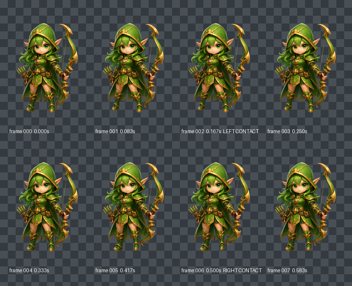
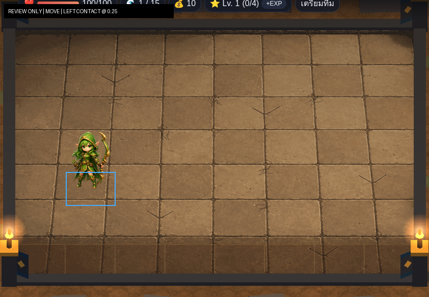
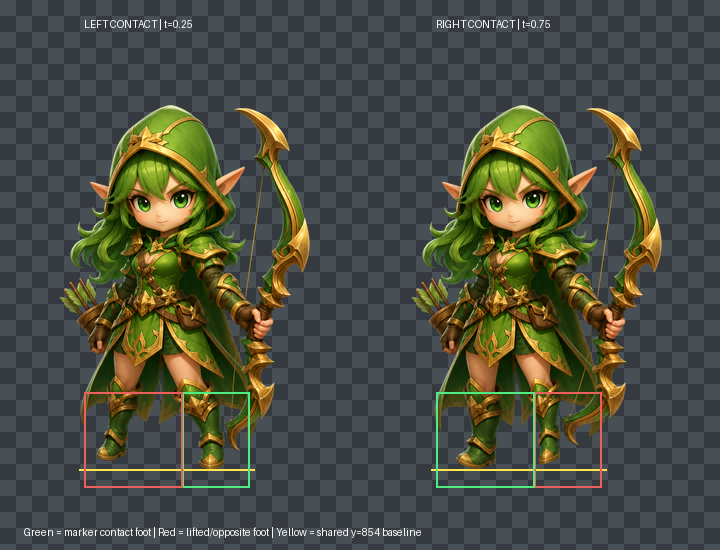

# Archer Move Production v1

## Decision boundary

This package contains one eight-frame `hero.archer` Move production candidate. It does not contain Attack, runtime integration, or a Move approval decision.

| Status | Value |
|---|---|
| `styleDirectionApproved` | `true` |
| `neutralMasterApproved` | `true` |
| `idlePackageApproved` | `true` |
| `movePackageApproved` | `false` |
| `canonicalApproved` | `false` |
| `runtimeEligible` | `false` |
| `runtimeIntegrated` | `false` |
| `attackGenerated` | `false` |

## Verified source and ancestry

GitHub was checked before production.

| Role | PR | Branch | Exact HEAD | Verified state |
|---|---:|---|---|---|
| Exact base and approved Idle overlay | #63 | `coco/archer-idle-package-exact-file-approval-v1` | `40b334937f394f54c1d1e97b729e37778644ee1e` | open, draft, unmerged |
| Motion technical baseline only | #56 | `cc/pilot-idle-motion-runtime-integration-v1` | `bbe63518c42761f49a0aa068c78e0d07d3e88214` | read-only; no ancestry imported |

This branch descends directly from exact PR #63. It does not merge, rebase, or cherry-pick CC runtime ancestry.

The exact Neutral Master remains:

| Field | Value |
|---|---|
| Candidate | `hero.archer.production-master.candidate.v1` |
| Path | `docs/assets/review/character-production/archer/master-v1/archer-production-master-candidate-v1.png` |
| SHA-256 | `4911e7e3ba59241ee011be3e62f1b64230dcf9b3c24c6aeb23dc939d83311013` |
| Format | 640×960 RGBA PNG |

The approved Idle source is `hero.archer.idle.chibi-production-candidate.v1`, approved by `data/design/archer-idle-package-exact-file-approval-v1.json` on exact PR #63. Its constraints govern identity, silhouette, readability, anchor discipline, and no-foot-slide behavior. Move pixels are independently derived from the Neutral Master rather than accumulated from Idle frames.

## Production method

The Move loop is deterministic source-derived articulation, not AI regeneration. Every frame independently samples the exact approved Neutral Master with bilinear filtering in premultiplied RGBA.

Rows y<610 are byte-identical to the Neutral Master in every frame. This locks the face, green eyes, green hood, green hair, pointed ears, upper costume, torso, upper bow, palette, and lighting. Only the lower-body locomotion field changes:

- primary alternating stride amplitude: 18 pixels;
- passing-phase bias: 3 pixels, preventing duplicate passing frames;
- opposite-foot lift: up to 14 pixels;
- viewer-left/character-right leg ground normalization: 31 pixels, measured from the staggered Neutral Master stance;
- accumulated frame-to-frame edits: none;
- baked world travel: none.

The upper-body stability keeps the Ranger class cue readable. Lower-body motion is deliberately smaller than an exaggerated run so the package remains compatible with board tween movement.

## Technical contract

| Property | Value |
|---|---|
| State | `move` |
| Frames | 8 |
| FPS | 12 |
| Duration | 0.666667 seconds |
| Loop | `true` |
| Root motion | `in-place` |
| `runtimeFlipX` | `true` |
| Canvas | 640×960 RGBA |
| Anchor | `[0.5, 0.92]` |
| Left marker | `leftFootstepCue @ 0.25`, frame 002 |
| Right marker | `rightFootstepCue @ 0.75`, frame 006 |

No marker was moved from the technical baseline.

## Frame inventory

| Frame | SHA-256 | Role | Support-foot y |
|---:|---|---|---:|
| 000 | `a9142fb9aff23110822e2eae491fd10a483aaec21f0ce44616108c3d5e797d79` | double-support passing A | 854 |
| 001 | `91ccd270ed2796d6a6d0d11a95582537af95cbfe0334c701022522f4e3def1fc` | left leg forward/down | 854 |
| 002 | `1b92c2c694f03866798c5c0d67e7a1a2f929b2d4181c172fa493c0f583f146d9` | left-foot contact | 854 |
| 003 | `904eff4bf047861d6e4da257ecd733471a2de73c36ca5333b0c7ec18b181e70c` | left support recovery | 854 |
| 004 | `8890f16ab7a903d7638a35e8fcc3456cb82ad49a67f0d4ff85371e55bbc3c2d9` | double-support passing B | 854 |
| 005 | `2d6f9200366e3056a8309e249f6fd2ddf31b32fea7538ae35860878126446d03` | right leg forward/down | 853 |
| 006 | `444f4b9833c3e5bd3be41c2873673b881e0ef7d40b1092ed1894cd4a33f3927c` | right-foot contact | 854 |
| 007 | `383adfadbeba4314ecade83b6080c753ed2a976fc80b03d4820b0546bdb035b1` | right support return | 852 |

All frame paths are under `assets/units/hero.archer/move-chibi-v1/`. Exact dimensions, alpha bounds, byte sizes, motion parameters, foot regions, centroids, and source operations are recorded in `assets/units/hero.archer/move-chibi-v1/source-map.json`.

## Marker and gait evidence

At frame 002, the anatomical left/viewer-right foot reaches y=854 with 74 visible contact pixels across rows 852–854. The opposite foot ends at y=837 with no pixels in the contact rows.

At frame 006, the anatomical right/viewer-left foot reaches y=854 with 61 contact pixels across rows 852–854. The opposite foot ends at y=845 with no pixels in the contact rows.

The contacts are visually distinct and align with the unchanged marker times. Frames 000/004 are different passing phases, so cadence does not repeat a duplicate held frame mid-loop.

## Anchor and in-place result

The baseline anchor `[0.5, 0.92]` is retained after measurement. Both marker contacts land exactly at y=854, giving a 29.2-pixel anchor-to-contact offset. Transitional support silhouettes range from y=852 to y=854; the maximum two-pixel package variation becomes approximately 0.31 pixels at the 98×147 board review scale.

The whole-frame alpha centroid moves only 1.836978 pixels horizontally and 3.723126 pixels vertically across the loop. Accumulated translation is zero, and no horizontal world travel is baked into the PNGs. Board movement therefore remains runtime-owned.

## Loop result

The normalized premultiplied-RGBA frame 007→000 seam is `0.009958632`, below the maximum internal adjacent difference `0.010189156`. No face, hood, hair, bow, upper-costume, scale, lighting, or root-position pop is present.

The strongest remaining review question is aesthetic rather than structural: the intentionally restrained lower-leg motion is readable at full size, but at board scale it becomes a compact gait cue rather than a dramatic run. Increasing amplitude would risk bow/body instability and exaggerated chibi deformation.

## Review artifacts

### Contact sheet

### Loop preview

The GIF is a 240×360, 12 FPS review derivative. It must not replace the eight production PNG frames.

### Board-scale sample

Frame 002 is reduced to 98×147 over the exact PR #55 Arena Ruins screenshot. The head, hood/ears, face opening, green/gold contrast, and bow remain readable. The legs remain separated enough to indicate locomotion without changing tile or camera geometry.

### Marker/contact diagnostic

Green identifies the marker contact foot, red the lifted opposite foot, and yellow the shared y=854 contact line. This is review evidence, not runtime geometry.

All review artifacts are `reviewOnly=true` and `runtimeEligible=false`.

## Approval and protected scope

The package passes technical source, identity, alpha, bounds, gait-marker, in-place, anchor, and loop checks. User approval remains required; this task does not set `movePackageApproved=true`.

No existing Move asset is overwritten. The approved Idle files and Neutral Master are unchanged. No Attack frame, `projectileRelease` marker, runtime code, `src/`, Core Logic, Combat, targeting, pathfinding, economy, stage logic, main loop, camera, board, map, or gameplay geometry is created or changed.

Attack production and runtime integration remain blocked until a separate Move exact-package approval.
