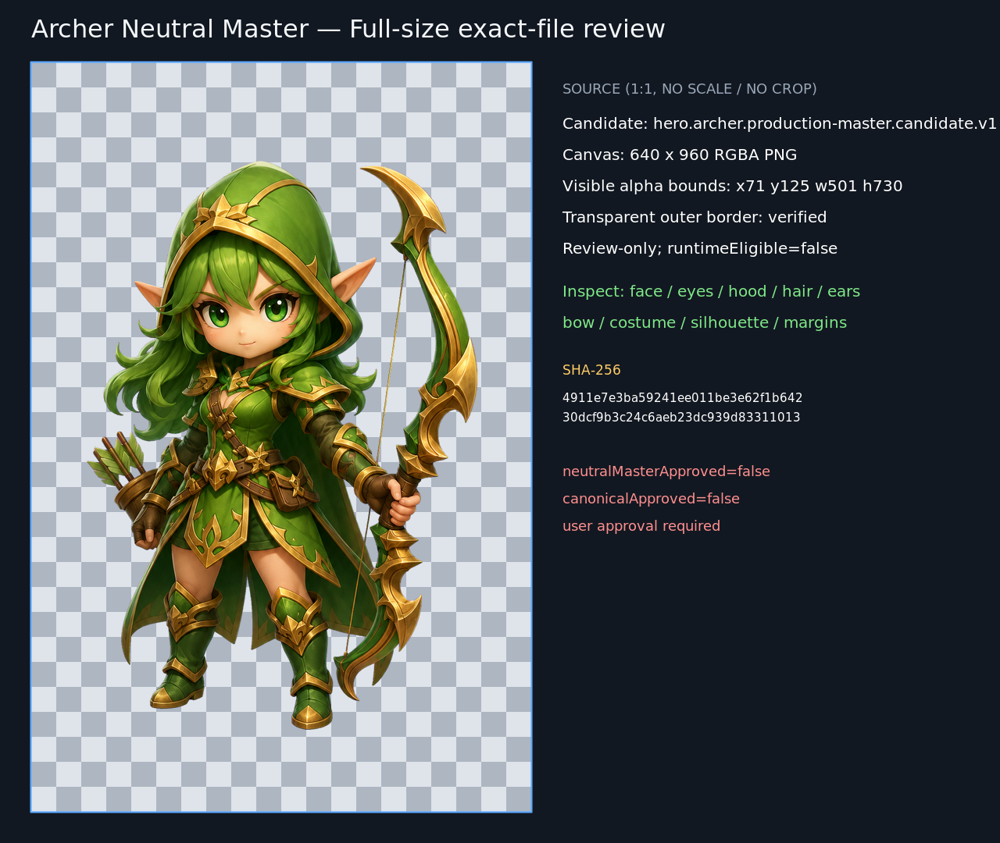
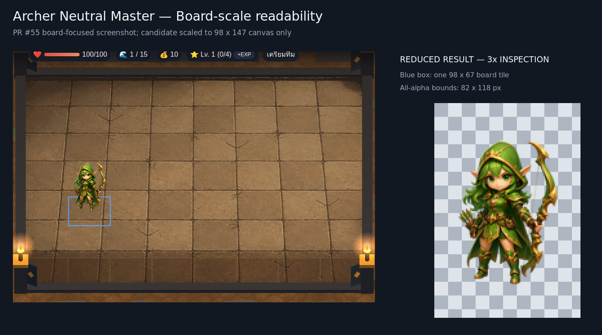
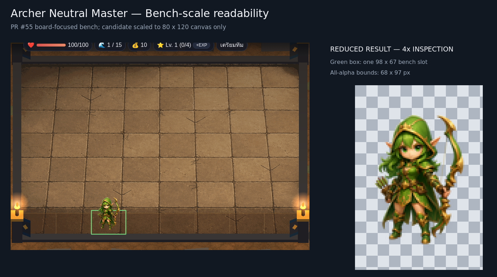
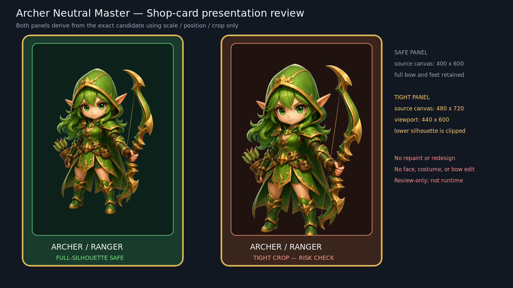

# Archer Neutral Master Approval Pack v1

## Decision boundary

This package presents the exact PR #59 Archer candidate in four review contexts. It does not regenerate, retouch, approve, promote, animate, or integrate the character.

| Status | Value |
|---|---|
| `styleDirectionApproved` | `true` |
| `neutralMasterApproved` | `false` |
| `canonicalApproved` | `false` |
| `runtimeEligible` | `false` |
| `reviewOnly` | `true` |
| `userApprovalRequired` | `true` |

Technical review results help the user decide; they do not constitute approval.

## Verified source and ancestry

GitHub was checked before the review assets were created.

| Role | PR | Branch | Exact HEAD | Verified state |
|---|---:|---|---|---|
| Exact candidate/base | #59 | `coco/archer-production-master-v1` | `47a60378af16920aea75f9c8e2192e52518459e9` | open, draft, unmerged |
| Style source | #58 | `coco/character-art-style-lock-and-migration-contract-v1` | `b3db907dfd33a181fae34859770c872319ab994e` | open, draft, unmerged |
| Arena Ruins screenshot only | #55 | `cc/arena-ruins-static-board-runtime-integration-v1` | `08744faad0df8ce5fe1e43461ba59687fd0aebe8` | read-only reference |

This branch starts at exact PR #59. Its merge-base with the style line is the exact PR #58 HEAD. PR #55 supplies screenshot pixels for board/bench comparison only; no CC commit, runtime file, or ancestry is imported.

## Immutable candidate

| Property | Exact value |
|---|---|
| Candidate ID | `hero.archer.production-master.candidate.v1` |
| Path | `docs/assets/review/character-production/archer/master-v1/archer-production-master-candidate-v1.png` |
| SHA-256 | `4911e7e3ba59241ee011be3e62f1b64230dcf9b3c24c6aeb23dc939d83311013` |
| Format | 640×960 RGBA PNG |
| Alpha bounds | x=71, y=125, width=501, height=730; top-left origin |
| Transparent margins | left 71, top 125, right 68, bottom 105 pixels |
| Outer-border alpha | zero non-transparent pixels |

The candidate file was not modified. Composites use only decode, uniform scaling, positioning, review crop, and alpha compositing. No character pixels were generated, redrawn, stylized, recolored, face-edited, costume-edited, weapon-edited, or proportion-edited.

## Review summary

| Context | Technical result | Approval result | Main finding |
|---|---|---|---|
| Full-size exact file | Pass | Pending user | Complete identity, equipment, alpha, and margins are inspectable at 1:1 |
| Board scale | Pass with observation | Pending user | Ranger and bow read immediately; fine facial/costume detail collapses as expected |
| Bench scale | Pass with concern | Pending user | Silhouette and bow survive; face and hood/hair separation are the highest risk |
| Shop card | Safe layout passes; tight crop fails | Pending user | Full-silhouette layout is strong; tighter crop clips lower silhouette |

## 1. Full-size exact-file review

The candidate is shown at native 640×960 scale over a 32-pixel checkerboard. It is not scaled or cropped. The face, large green eyes, hood, front and side hair locks, pointed ears, bow construction, quiver, costume hierarchy, cape, feet, transparency, and margins are all available for exact-file inspection.

Technical result: **pass**. The full hood, bow tip, hair, cape, quiver, hands, and both feet are inside the canvas. This remains `pending-user-approval` because only the user may approve the exact file.

## 2. Board-scale readability

The candidate canvas is uniformly reduced from 640×960 to 98×147 with Lanczos filtering and placed over the exact PR #55 board-focused screenshot. The blue rectangle is one 98×67 board tile. The right inset is a point-filtered three-times magnification of the already reduced result, not an alternate Archer.

Observations:

- the green hood, pointed ears, gold trim, bow arc, and compact body make Ranger identity immediate;
- the all-alpha reduced silhouette is approximately 82×118 pixels and stays within one tile width;
- the bow remains distinct from the body and does not cover the face;
- the face and two-eye pattern remain locatable at native context scale;
- iris detail, leather detail, and small gold ornaments collapse at this size, as expected;
- warm skin, bright eyes, and gold edges prevent the green hood/hair mass from disappearing against warm Arena Ruins stone.

Technical result: **pass with observation**. The current scale is comparable to the existing pilot presentation. This screenshot review does not validate browser anchoring and does not authorize tile, camera, or unit-geometry changes.

## 3. Bench-scale readability

The candidate canvas is uniformly reduced to 80×120 and placed over the exact PR #55 bench row. The green rectangle marks one 98×67 slot. The right inset is a four-times diagnostic magnification of the reduced result.

Observations:

- the all-alpha silhouette is approximately 68×97 pixels and leaves horizontal space inside the slot;
- hood, ears, bow, quiver, cape, legs, and feet remain uncropped;
- bow and green/gold blocks preserve the class read;
- native-scale facial detail is marginal, and the hood/hair merge more than at board scale;
- gold hood trim and the open skin/eye region are therefore important continuity features for later exports.

Technical result: **pass with concern**. The current candidate is usable for bench presentation, but face readability is the approval pack's clearest small-scale risk. The diagnostic inset must not be mistaken for the native bench read. Runtime slot size or geometry must not be changed to compensate.

## 4. Shop-card presentation

Both panels use the exact candidate. The card shapes are neutral review primitives, not production UI assets.

- **Full-silhouette safe:** candidate scaled to 400×600 with no crop. Face and eyes remain focal; the full bow, hair, cape, legs, and feet remain visible. The bow sits beside rather than over the face.
- **Tight crop risk:** candidate scaled to 480×720 and cropped to a 440×600 viewport. The alpha bounds reach the bottom edge, clipping the feet and lower bow silhouette. This layout is not recommended.

Technical result: **safe layout passes; tight crop fails crop safety**. Shop frame, rarity, title, cost, and other UI remain separate ownership and must never be baked into the Neutral Master.

## Readability risks and recommendation

The candidate has strong full-size identity and strong shop-card presentation. Its oversized bow is an effective class cue at every tested scale. Board presentation remains readable and tile-width safe. Bench presentation is the limiting context: the face is still locatable, but individual eye and hair detail becomes marginal.

The technical recommendation is to review the exact candidate, board context, native bench context, and full-silhouette shop layout together. If the user accepts the bench-scale face/hood-hair compression, the exact file is suitable to move to a separate user-approval recording step. This document deliberately leaves every approval flag false.

## Provenance and protected scope

Board and bench composites use `docs/assets/review/arena-ruins/runtime-integration-v1/board-focused-view.png` from exact PR #55 as a read-only background. Its SHA-256 is `a37f70609b036b7ce997ec71375e47a73898123795d4ebea21e4da5721e349f8`. The standalone screenshot is not imported into this branch.

Every output is under `docs/assets/review/character-production/archer/approval-pack-v1/`, with `reviewOnly=true` and `runtimeEligible=false`. None replaces `assets/archer.png`, motion frames, portraits, or class icons.

No Idle, Move, Attack, spritesheet, GIF, interpolation, sidecar, source-map, marker, runtime, Core Logic, Combat, targeting, pathfinding, economy, stage, main-loop, camera, board, bench, or map change is part of this pack.

The future sequence remains: Neutral Master user approval → Archer Idle → Archer Move → Archer Attack → separate CC runtime integration.
