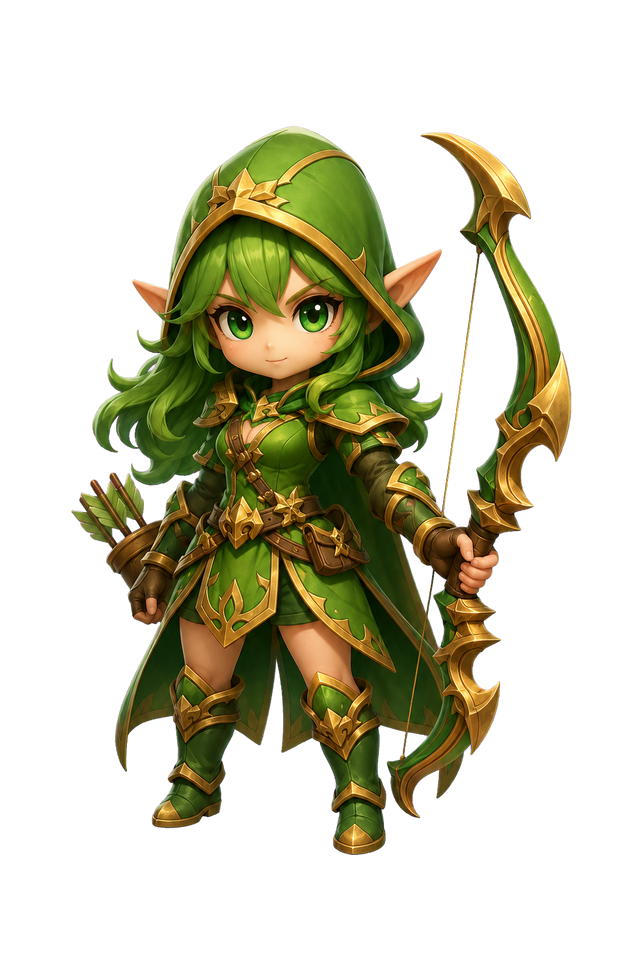

# Archer Production Master v1 — New Chibi Style Pilot

## Status and approval boundary

This package locks one review candidate and the production contract for `hero.archer`. It does not approve, promote, or integrate a production asset.

| Field | Value |
|---|---|
| `styleDirectionApproved` | `true` |
| `productionMasterCandidatePending` | `false` — a review candidate exists |
| `neutralMasterApproved` | `false` |
| `canonicalApproved` | `false` |
| `runtimeEligible` | `false` |
| Motion produced | No |
| Runtime integration | No |

The required next gate is explicit user approval of the exact candidate file. Generation, technical validation, and inclusion in this review package do not pass that gate.

## Verified source and ancestry

GitHub was checked on 2026-07-19 before production work.

| Role | PR | Branch | Exact HEAD | Verified state |
|---|---:|---|---|---|
| Authoritative style/source base | #58 | `coco/character-art-style-lock-and-migration-contract-v1` | `b3db907dfd33a181fae34859770c872319ab994e` | open, draft, unmerged |
| Arena Ruins reference only | #55 | `cc/arena-ruins-static-board-runtime-integration-v1` | `08744faad0df8ce5fe1e43461ba59687fd0aebe8` | open, draft, unmerged |
| Motion/runtime technical reference only | #56 | `cc/pilot-idle-motion-runtime-integration-v1` | `bbe63518c42761f49a0aa068c78e0d07d3e88214` | open, draft, unmerged |

PR #58 was the latest source-of-truth contract and had no newer descendant at verification time. Its changed paths were limited to the style contract, reference manifest, human review document, and three archived non-runtime references. PR #58 and both CC runtime branches diverge after merge-base `3300d02488e6a4715c87d20ac30e3ed53fdfca6f`; neither CC branch is an ancestor or descendant of the Coco style line. This work therefore starts from the exact PR #58 HEAD and does not merge, rebase, or cherry-pick PR #55 or #56.

## Exact PR #58 inputs

The authoritative inputs are:

- `data/design/character-art-reference-manifest-v1.json`
- `data/design/character-art-style-lock-and-migration-contract-v1.json`
- `docs/reviews/character-art-style-lock-and-migration-contract-v1.md`
- `docs/assets/reference/character-art-style-lock-v1/gameplay-character-style-context-reference.jpg`

The manifest does not contain a standalone Archer binary. `style_anchor_archer` correctly has `archiveStatus=archived_shared_primary_binary` and shares the gameplay context reference:

| Logical ID | Path | SHA-256 | Dimensions | Role |
|---|---|---|---:|---|
| `gameplay_character_style_context_reference` | `docs/assets/reference/character-art-style-lock-v1/gameplay-character-style-context-reference.jpg` | `f65408331cf5fbf2b28fcf8f2522d9698f6108a21e84714592fb012620089aec` | 1536×864 JPEG | Primary character style context |
| `style_anchor_archer` | same shared binary | same shared hash | same shared dimensions | Green Archer in the lower shop card and matching board unit, plus the locked written traits |

No separate Archer anchor was fabricated. Slime and Golem remain style-language references only and are not production targets here.

## Review candidate

| Property | Exact value |
|---|---|
| Candidate ID | `hero.archer.production-master.candidate.v1` |
| Repository path | `docs/assets/review/character-production/archer/master-v1/archer-production-master-candidate-v1.png` |
| SHA-256 | `4911e7e3ba59241ee011be3e62f1b64230dcf9b3c24c6aeb23dc939d83311013` |
| Size | 569,259 bytes |
| Format | 640×960 RGBA PNG, 2:3 |
| Visible alpha bounds | x=71, y=125, width=501, height=730; top-left origin |
| Border alpha | zero non-transparent pixels on the four outer borders |
| Provenance | Generated from the archived PR #58 gameplay context reference and Archer lock on 2026-07-19; chroma field converted to real alpha, color spill removed, resized to the existing 640×960 working-canvas recommendation |
| Status | review-only; exact-file approval pending |

The generation brief requested a single full-body female fantasy Ranger with green hood and hair, pointed ears, large green eyes, an ornate oversized green/gold bow, green/gold outfit, approximately 2.5–3-head chibi proportions, and a centered three-quarter combat-ready neutral stance. It excluded attack/walk poses, crop, card/UI/text, environment, floor, and baked shadow. The file was checked on transparency and over a warm-stone surrogate background; that technical check is not a substitute for user approval.

## Archer identity lock

The identity is a youthful female Archer/Ranger who is cute and approachable while remaining combat-ready.

| Element | Locked definition | Continuity requirement |
|---|---|---|
| Face | Large expressive green eyes; simplified readable anatomy | Face and eye shape cannot drift across future motion or presentation derivatives |
| Hair | Green, with readable front/side swept silhouette | Parting, mass, and major locks remain consistent |
| Hood | Green Ranger hood with readable gold trim | Must frame rather than hide the eyes and face |
| Ears | Pointed, elf-like | Size, angle, and placement remain stable |
| Outfit | Green-dominant Ranger fantasy outfit, gold accents, dark leather support | Preserve class read; do not add micro-detail that collapses at board scale |
| Bow | Ornate green/gold fantasy bow, slightly oversized | Curvature, gold tips, green inset, grip, string, and handedness relationship remain stable |
| Tone | Cute, heroic, approachable, battle-ready | No realistic-adult or baby-style drift |

Identity priority is fixed: silhouette → face/head → bow/Ranger cue → dominant green → secondary costume detail.

## Neutral Master specification

The Neutral Master is the identity source for later Idle, Move, Attack, shop-card, bench, board-unit, and portrait/icon derivatives. It is not itself a motion frame.

Required composition:

- full head, bow, body, and feet visible; no crop;
- centered on a transparent canvas with margin on all sides;
- consistent three-quarter gameplay-compatible presentation;
- combat-ready neutral stance, not an attack key, walk/run pose, or exaggerated idle extreme;
- RGBA PNG with no UI, text, card frame, scene, floor, baked shadow, or board-specific pixels.

The recommended working canvas is 640×960 (2:3). The existing Archer pipeline already uses a 2:3 frame shape and its source contract recommends a 640×960 working canvas, a maximum source dimension of 1024, and smaller battle exports. Keeping that shape minimizes migration and framing cost while retaining enough detail for the new style. A future task must choose runtime export dimensions after approval; this master does not silently change runtime display size.

The existing `[0.5, 0.92]` anchor is a provisional technical baseline only. After exact-file approval, feet placement and visible bounds must be measured before motion. If the new proportion needs a different anchor, record and validate the migration in the future motion package; do not change runtime to compensate here.

## Gameplay-scale approval gates

Only the full-size candidate exists in this package. Board, bench, and shop-card review composites remain pending and must be generated as review-only derivatives without changing runtime, camera, or board geometry.

| Context | Required evidence | Current status |
|---|---|---|
| Full-size master | Identity matches lock; face/hood/ears/hair/outfit/bow coherent; full body; clean alpha and margins | Pending user exact-file approval |
| Board scale | Face survives reduction; bow reads immediately; silhouette separates from Arena Ruins warm stone; no geometry change required | Pending review composite |
| Bench scale | Hood and hair do not merge into one blob; Ranger read remains; feet and bow fit the slot | Pending review composite |
| Shop card | Face/eyes remain focal; bow and green/gold class cues remain visible; UI frame stays separate ownership | Pending review composite |

All four must pass before `neutralMasterApproved` may become true. The current candidate shows strong separation through green/gold value contrast, skin and eye focal contrast, and a crisp bow silhouette, but only an explicit review can approve those judgments.

## Existing Archer migration audit

No existing asset is deleted, overwritten, retouched, or promoted in this task.

### Technically reusable

- `src/asset-animation-runtime.js`: loader, state machine, FPS sanitization, fallback, cache/ref-count disposal, and marker delivery.
- `src/motion-test-harness.js`: state selection, playback speeds, pause/restart, `flipX`, transitions, diagnostics, and disposal.
- Existing sidecar/source-map schema: unit/state IDs, FPS, loop, root motion, anchor, markers, `runtimeFlipX`, frame validation, and provenance.
- Existing runtime/harness/transition/frame/pipeline validators.

Technical reuse never implies approval of old visual frames.

### Visual replacement planned

| Existing path | Replacement target | Dependency and gate |
|---|---|---|
| `assets/archer.png` | Future approved static/neutral runtime derivative | Approved exact Neutral Master, then runtime-size/anchor and derivative-hash approval |
| `assets/units/hero.archer/idle/*.png` | New-style Idle package | Neutral Master approval, then loop/continuity/alpha/anchor validation |
| `assets/units/hero.archer/move/*.png` | New-style Move package | Approved master and Idle; footstep markers, in-place root motion, `runtimeFlipX`, alpha, anchor validation |
| `assets/units/hero.archer/attack/*.png` | New-style Attack package | Approved master/Idle/Move; release marker, non-loop, in-place root motion, alpha, anchor validation |
| `assets/v5/body_archer.png` | Future presentation derivative if the v5 composer remains active | Ownership audit and exact visual review after master approval |
| `assets/v5/face_archer.png` | Future face/portrait derivative if the v5 composer remains active | Portrait crop and face-continuity review after master approval |
| `assets/heroes/sniper_sheet.png` | Future female Sniper package | Separate Class 2 identity contract and exact-file approval; out of this task |
| `assets/portraits/sniper.png` | Future approved Sniper portrait derivative | Separate Class 2 master and portrait approval; out of this task |

### Review required

`assets/icons/classes/ranger.png` is a class/synergy icon rather than a character production binary. Retain it unless a separate UI icon review finds a semantic or small-scale failure. `assets/mon_spiritarcher.png` is a monster, not `hero.archer`, and is explicitly outside this migration map.

## Future motion compatibility

No Idle, Move, Attack, GIF, spritesheet, interpolation, or marker change is made here. The PR #56 technical baseline remains:

| State | FPS | Frames | Loop | Root motion | Markers | Anchor |
|---|---:|---:|---|---|---|---|
| Idle | 8 | 8 | true | in-place | none | `[0.5, 0.92]` |
| Move | 12 | 8 | true | in-place; `runtimeFlipX=true` | `leftFootstepCue@0.25`, `rightFootstepCue@0.75` | `[0.5, 0.92]` |
| Attack | 12 | 10 | false | in-place | `projectileRelease@0.55` | `[0.5, 0.92]` |

Preserve these semantics unless future measured evidence requires a deliberately reviewed migration. Art-style change alone is not permission to change timing, loop behavior, markers, root motion, facing, runtime code, or gameplay.

The ordered gate is: exact Neutral Master approval → Archer Idle → Archer Move → Archer Attack → separate CC runtime integration. Each arrow is an approval boundary, not authorization to produce the next package in this task.

## Protected scope and non-goals

This package contains only review art, documentation, and design metadata. It makes no changes to `src/`, Core Logic, Combat, targeting, pathfinding, economy, stage logic, main loop, camera, board geometry, map runtime, motion runtime, existing production frames, or any non-Archer character. It does not merge a PR and does not set `neutralMasterApproved`, `canonicalApproved`, or `runtimeEligible` to true.
